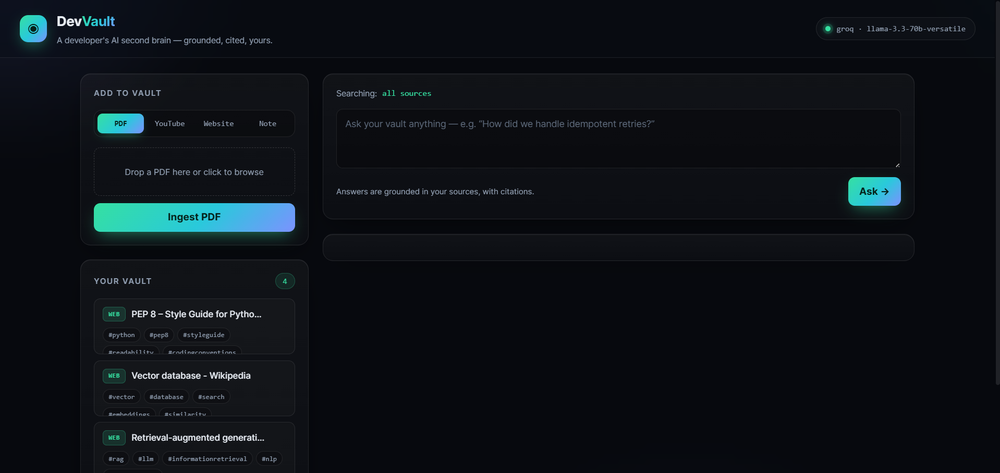

<div align="center">

# 🧠 DevVault

### A developer's AI second brain — ingest your docs, talks, and notes, then ask questions and get answers **grounded in your own sources, with citations.**

[](https://devvault-cpf6.onrender.com)
[](https://www.python.org/)
[](https://fastapi.tiangolo.com/)
[](https://www.trychroma.com/)
[](https://groq.com/)
[](https://www.anthropic.com/)
[](Dockerfile)
[](LICENSE)

**Retrieval-Augmented Generation · Local vector DB · Grounded citations · Zero-cost to run**

### 🔗 Live demo → **[devvault-cpf6.onrender.com](https://devvault-cpf6.onrender.com)**

<sub>Hosted free on Render — the first request after idle may take ~30–60s to wake, and the demo vault resets periodically.</sub>

[Features](#-features) · [Demo](#️-demo) · [Architecture](#️-architecture) · [Quickstart](#-quickstart) · [Deploy](#️-deploy-free)

</div>

---

## Why DevVault

"Chat with your PDFs" apps are everywhere and mostly the same. **DevVault** narrows the
idea to the developer workflow and does the hard parts well: every answer is **grounded
strictly in your own material and traceable to the exact source text**, embeddings run
**locally** (so search is free and private), and the LLM backend is **swappable** between
free Groq and Claude. It's a compact, end-to-end showcase of the skills behind modern AI
apps — **RAG, vector databases, and LLM orchestration.**

## ✨ Features

| | Feature | How |
|---|---|---|
| 📥 | **Ingest anything** | PDFs, YouTube transcripts, web pages, and freeform notes |
| 🔎 | **Ask your vault** | Semantic retrieval + an LLM, answered **only** from your sources |
| 🔗 | **Real citations** | Answers link back to the exact source text they used |
| 📝 | **Auto summaries** | Every source gets a TL;DR + key bullets on ingest |
| 🏷️ | **Auto-organize** | Sources are auto-tagged so the vault stays browsable |
| 🎴 | **Flashcards** | Turn any source into Q&A cards for active recall |
| 🎯 | **Scoped search** | Query everything, or narrow to a single source |
| 🆓 | **Local-first & free** | Embeddings run on-device; Groq powers the LLM at no cost |

## 🖼️ Demo

<p align="center">
  
</p>

<div align="center"><sub>A glassmorphism dark UI: add sources on the left, ask on the right, get cited answers and flashcards.</sub></div>

## 🏗️ Architecture

```
                    ┌───────────────── Frontend (vanilla JS SPA) ─────────────────┐
                    │  add sources · browse vault · ask · citations · flashcards   │
                    └──────────────────────────────┬──────────────────────────────┘
                                                    │ REST /api/*
┌──────────────────────────────── FastAPI (backend/) ┴──────────────────────────────┐
│  ingest.py      loaders: pypdf · youtube-transcript-api · httpx + BeautifulSoup    │
│  chunking.py    boundary-aware overlapping chunks                                   │
│  vectorstore.py ChromaDB (persistent, local MiniLM embeddings) ── semantic search  │
│  db.py          SQLite registry: titles, summaries, tags, full text                │
│  llm.py         pluggable provider → Groq (free) or Claude (native citations)      │
└────────────────────────────────────────────────────────────────────────────────────┘
```

**Retrieval → generation flow:**
1. Embed the question locally and pull the top-K chunks from ChromaDB.
2. Pass those chunks to the LLM as grounding context with citations enabled.
3. The model answers strictly from them; citations map each claim back to its source.

## 🧰 Tech stack

**Backend** Python · FastAPI · Uvicorn  **·  Retrieval** ChromaDB · all-MiniLM-L6-v2 (ONNX, local)
**·  LLM** Groq (Llama 3.3 70B) / Anthropic Claude  **·  Ingestion** pypdf · BeautifulSoup · youtube-transcript-api
**·  Storage** SQLite  **·  Frontend** vanilla HTML/CSS/JS (no build step)  **·  Deploy** Docker

## 🚀 Quickstart

```bash
git clone https://github.com/Subhajeevan/Devvault-.git && cd Devvault-
python -m venv .venv && .venv\Scripts\activate      # (macOS/Linux: source .venv/bin/activate)
pip install -r requirements.txt

cp .env.example .env      # then set GROQ_API_KEY (free, no card: https://console.groq.com)
python run.py             # → http://127.0.0.1:8000
```

> Ingestion and semantic search work with **no API key** (embeddings are local). A key
> only unlocks Q&A, summaries, and flashcards. First run downloads a ~80 MB embedding model once.

## ☁️ Deploy (free)

One `Dockerfile`, deployable on Render, Hugging Face Spaces, Fly, Railway, or Cloud Run.
A [`render.yaml`](render.yaml) blueprint makes Render one-click:

[](https://render.com/deploy?repo=https://github.com/Subhajeevan/Devvault-)

Then set `GROQ_API_KEY` in the Render dashboard. **See [DEPLOY.md](DEPLOY.md)** for the full
walkthrough and other hosts. Run it locally with Docker:

```bash
docker build -t devvault . && docker run -p 7860:7860 -e GROQ_API_KEY=gsk_… devvault
```

## 🔌 API

| Method | Path | Purpose |
| --- | --- | --- |
| `GET`  | `/api/health` | status, provider, model, source count |
| `GET` / `DELETE` | `/api/sources[/{id}]` | list / detail / remove sources |
| `POST` | `/api/ingest/{pdf,youtube,web,note}` | add a source |
| `POST` | `/api/ask` | `{question, source_ids?}` → answer + citations |
| `POST` | `/api/sources/{id}/flashcards` | generate flashcards |

## 🗺️ Roadmap

- [ ] Streaming answers (SSE) for a live typing effect
- [ ] Ingest GitHub repos, issues, and Stack Overflow threads
- [ ] Spaced-repetition scheduling on flashcards
- [ ] Fully-offline mode with a local LLM (Ollama)

## 📄 License

MIT © [Subhajeevan](https://github.com/Subhajeevan) — see [LICENSE](LICENSE).
